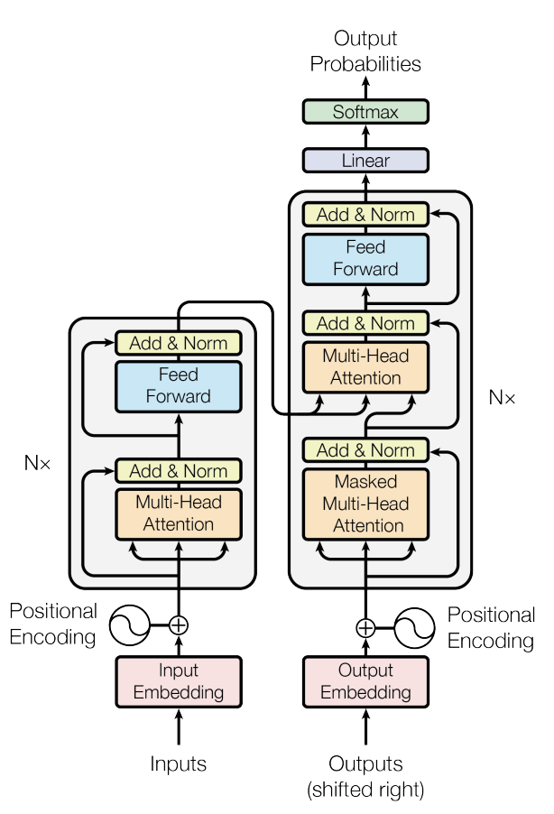

# Implementation of Attention is All you Need(2017)

   

### Index

## Abstract

The dominant sequence transduction models are based on complex recurrent or convolutional neural networks in an encoder-
decoder configuration. 
The best performing models also connect the encoder and decoder through an attention mechanism. 
We propose a new simple network architecture, the Transformer, based solely on attention mechanisms, dispensing with 
recurrence and convolutions entirely. Experiments on two machine translation tasks show these models to be superior 
in quality while being more parallelizable and requiring significantly less time to train. 

Our model achieves 28.4 BLEU on the WMT 2014 English-to-German translation task, improving over the existing best results,
including ensembles by over 2 BLEU. On the WMT 2014 English-to-French translation task, our model establishes a new 
single-model state-of-the-art BLEU score of 41.8 after training for 3.5 days on eight GPUs, a small fraction of the
training costs of the best models from the literature. 
We show that the Transformer generalizes well to other tasks by applying it successfully to English constituency parsing
both with large and limited training data.

## Model Architecture 



## Environment 

```markdown
- python == 3.8 native ARM64 version
- pytorch Nightly build for Apple Silicon(GPU Acceleration Supported) 
- numpy == 1.22.4
```

## Train

```python
python main.py --train 
```

## Inference

```python
python main.py --inference
```